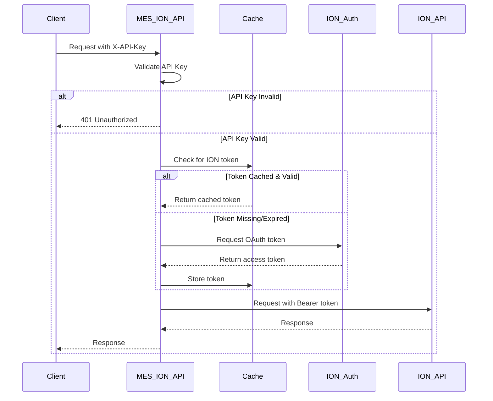
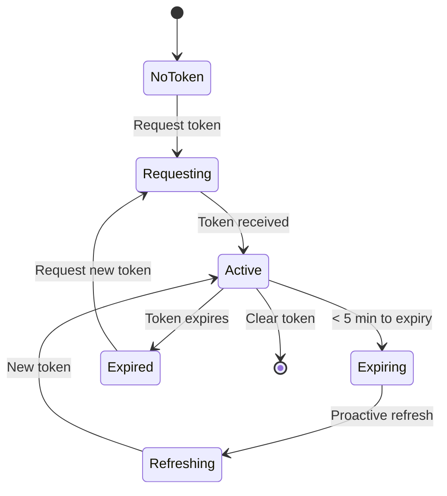

# ION Authentication Guide

## Table of Contents

1. [Overview](#overview)
2. [Authentication Flow](#authentication-flow)
3. [Configuration](#configuration)
4. [API Key Management](#api-key-management)
5. [Token Management](#token-management)
6. [Monitoring & Metrics](#monitoring--metrics)
7. [Error Handling](#error-handling)
8. [Troubleshooting](#troubleshooting)
9. [Best Practices](#best-practices)

## Overview

The MES ION API uses a two-layer authentication system:
1. **API Key Authentication**: Clients authenticate to the MES ION API using API keys
2. **OAuth 2.0 Authentication**: The MES ION API authenticates to Infor ION using OAuth 2.0 client credentials

This guide covers both authentication layers and how they work together.

## Authentication Flow

### Complete Authentication Flow



### API Key Authentication

API keys are used to authenticate clients to the MES ION API:

```http
GET /api/v1/manufacturing-orders
X-API-Key: msk_your_api_key_here
```

### OAuth 2.0 Authentication

The MES ION API authenticates to ION using OAuth 2.0 client credentials:

```http
POST https://mingle-ionapi.inforcloudsuite.com/TENANT/as/token.oauth2
Content-Type: application/x-www-form-urlencoded

grant_type=client_credentials&
client_id=TENANT~ClientId&
client_secret=ClientSecret
```

## Configuration

### Required Environment Variables

```env
# ION OAuth Configuration
ION_TENANT_ID=your-tenant-id
ION_CLIENT_ID=your-client-id
ION_CLIENT_SECRET=your-client-secret
ION_TOKEN_ENDPOINT=https://mingle-ionapi.inforcloudsuite.com/TENANT/as/token.oauth2
ION_API_ENDPOINT=https://mingle-ionapi.inforcloudsuite.com/TENANT

# Optional ION Configuration
ION_SUBSCRIPTION_KEY=your-subscription-key  # For API Management
ION_ORGANIZATION=your-organization          # For multi-org tenants

# Security Configuration
API_KEY_SALT=your-random-salt-here         # For hashing API keys
```

### Token Refresher Configuration

The background token refresher can be configured during initialization:

```typescript
initializeTokenRefresher(authManager, {
  refreshBeforeExpiry: 300,  // Refresh 5 minutes before expiry
  checkInterval: 60000,      // Check every minute
});
```

## API Key Management

### Generating API Keys

API keys follow the format: `msk_<32-byte-random-string>`

```typescript
import { generateApiKey } from './middleware/auth';

const newApiKey = generateApiKey();
// Example: msk_A1B2C3D4E5F6G7H8I9J0K1L2M3N4O5P6
```

### Registering API Keys

In development, API keys can be registered programmatically:

```typescript
import { registerApiKey } from './middleware/auth';

registerApiKey(
  'msk_your_api_key',
  'client-id',
  'Client Name',
  ['manufacturing-order:read', 'operation:report']
);
```

### Default Development API Keys

In development mode, the following API keys are pre-configured:
- `dev-api-key-mes-workflow` - For the MES Workflow API
- `dev-api-key-mes-ui` - For the MES Workflow UI

### Permissions

API keys can have granular permissions:

```typescript
const permissions = [
  'manufacturing-order:read',
  'manufacturing-order:write',
  'operation:report',
  'material:issue',
  '*'  // Wildcard for all permissions
];
```

## Token Management

### Token Caching

ION OAuth tokens are cached to minimize authentication requests:
- Cache key: `ion:oauth:token`
- TTL: Token expiry time minus 60 seconds (safety margin)
- Storage: Configurable (memory or Redis)

### Automatic Token Refresh

The system includes three token refresh mechanisms:

1. **Proactive Refresh**: Background process refreshes tokens before expiry
2. **Reactive Refresh**: Automatic retry on 401 errors
3. **Manual Refresh**: Triggered via API or admin interface

### Token Lifecycle



## Monitoring & Metrics

### Available Metrics

The system exposes Prometheus metrics at `/metrics`:

#### Authentication Metrics
- `ion_auth_token_requests_total` - Total OAuth token requests
- `ion_auth_token_cache_hits_total` - Token cache hits
- `ion_auth_token_cache_misses_total` - Token cache misses
- `ion_auth_token_refreshes_total` - Token refresh attempts
- `ion_auth_token_request_duration_seconds` - OAuth request duration
- `ion_auth_token_expiry_seconds` - Time until token expiry
- `ion_auth_active_tokens` - Number of active tokens

#### API Metrics
- `ion_api_requests_total` - Total API requests
- `ion_api_request_duration_seconds` - API request duration
- `ion_api_request_errors_total` - API request errors
- `ion_api_rate_limit_hits_total` - Rate limit hits

### Grafana Dashboard Example

```json
{
  "panels": [
    {
      "title": "Token Cache Hit Rate",
      "targets": [{
        "expr": "rate(ion_auth_token_cache_hits_total[5m]) / (rate(ion_auth_token_cache_hits_total[5m]) + rate(ion_auth_token_cache_misses_total[5m]))"
      }]
    },
    {
      "title": "OAuth Request Duration",
      "targets": [{
        "expr": "histogram_quantile(0.95, rate(ion_auth_token_request_duration_seconds_bucket[5m]))"
      }]
    }
  ]
}
```

## Error Handling

### Authentication Error Types

```typescript
enum IONAuthErrorCode {
  INVALID_CREDENTIALS = 'ION_AUTH_INVALID_CREDENTIALS',
  TOKEN_EXPIRED = 'ION_AUTH_TOKEN_EXPIRED',
  TOKEN_REFRESH_FAILED = 'ION_AUTH_TOKEN_REFRESH_FAILED',
  NETWORK_ERROR = 'ION_AUTH_NETWORK_ERROR',
  CONFIGURATION_ERROR = 'ION_AUTH_CONFIGURATION_ERROR',
  RATE_LIMITED = 'ION_AUTH_RATE_LIMITED',
  SERVICE_UNAVAILABLE = 'ION_AUTH_SERVICE_UNAVAILABLE',
  UNKNOWN_ERROR = 'ION_AUTH_UNKNOWN_ERROR',
}
```

### Error Response Format

```json
{
  "error": {
    "name": "IONAuthenticationError",
    "code": "ION_AUTH_INVALID_CREDENTIALS",
    "message": "Invalid ION API credentials",
    "statusCode": 401,
    "retryable": false,
    "details": {
      "oauthError": "invalid_client",
      "description": "Client authentication failed"
    }
  }
}
```

## Troubleshooting

### Common Issues and Solutions

#### 1. Invalid Credentials (401)

**Symptoms:**
- `ION_AUTH_INVALID_CREDENTIALS` error
- OAuth response: `invalid_client` or `invalid_grant`

**Solutions:**
1. Verify ION_CLIENT_ID format: `TENANT~ClientId`
2. Check ION_CLIENT_SECRET is correct
3. Ensure OAuth app is active in ION
4. Verify tenant ID in token endpoint URL

```bash
# Test OAuth credentials
curl -X POST "https://mingle-ionapi.inforcloudsuite.com/TENANT/as/token.oauth2" \
  -H "Content-Type: application/x-www-form-urlencoded" \
  -d "grant_type=client_credentials" \
  -d "client_id=$ION_CLIENT_ID" \
  -d "client_secret=$ION_CLIENT_SECRET"
```

#### 2. Token Expiry Issues

**Symptoms:**
- Frequent 401 errors
- Token expires before refresh

**Solutions:**
1. Check token refresher is running:
   ```typescript
   const refresher = getTokenRefresher();
   console.log(refresher?.getStatus());
   ```

2. Adjust refresh timing:
   ```typescript
   initializeTokenRefresher(authManager, {
     refreshBeforeExpiry: 600,  // 10 minutes before expiry
   });
   ```

3. Monitor token expiry metric:
   ```
   ion_auth_token_expiry_seconds
   ```

#### 3. Network Connectivity

**Symptoms:**
- `ION_AUTH_NETWORK_ERROR`
- Timeout errors

**Solutions:**
1. Check network connectivity to ION:
   ```bash
   curl -I https://mingle-ionapi.inforcloudsuite.com
   ```

2. Verify firewall rules allow HTTPS to ION

3. Check proxy configuration if applicable

4. Increase timeout:
   ```env
   REQUEST_TIMEOUT_MS=60000  # 60 seconds
   ```

#### 4. Rate Limiting

**Symptoms:**
- `ION_AUTH_RATE_LIMITED` error
- 429 status codes

**Solutions:**
1. Check rate limit metrics:
   ```
   ion_api_rate_limit_hits_total
   ```

2. Implement exponential backoff:
   ```typescript
   const retryAfter = error.retryAfter || 60;
   await sleep(retryAfter * 1000);
   ```

3. Reduce request frequency

4. Contact Infor support for rate limit increase

#### 5. Cache Issues

**Symptoms:**
- Token not being cached
- Excessive OAuth requests

**Solutions:**
1. Check cache configuration:
   ```env
   CACHE_DRIVER=redis  # Use Redis for production
   REDIS_URL=redis://localhost:6379
   ```

2. Monitor cache metrics:
   ```
   cache_operations_total{operation="set",status="failure"}
   ```

3. Clear cache if corrupted:
   ```typescript
   await cache.clear();
   ```

### Debug Logging

Enable debug logging for authentication:

```env
LOG_LEVEL=debug
DEBUG=mes-ion-api:auth
```

### Health Check Endpoints

Use these endpoints to verify authentication status:

```bash
# Check overall health
curl http://localhost:3000/health

# Check ION connectivity (requires API key)
curl -H "X-API-Key: your-key" http://localhost:3000/api/v1/health/ion

# View metrics
curl http://localhost:3000/metrics | grep ion_auth
```

## Best Practices

### 1. Security
- Store credentials in secure vaults (not in code)
- Rotate API keys regularly
- Use HTTPS for all communications
- Implement least-privilege permissions

### 2. Performance
- Use Redis cache in production
- Monitor cache hit rates (target > 95%)
- Enable token refresher for proactive refresh
- Implement connection pooling

### 3. Reliability
- Implement retry logic with exponential backoff
- Handle all error types explicitly
- Monitor authentication metrics
- Set up alerts for auth failures

### 4. Development
- Use different credentials for each environment
- Test with expired tokens
- Simulate network failures
- Verify permission checks

### Example Implementation

```typescript
import { IONApiClient, IONAuthManager, initializeTokenRefresher } from './integrations/ion';
import { authMiddleware, requirePermission, Permissions } from './middleware';

// Initialize authentication
const authManager = new IONAuthManager();
const tokenRefresher = initializeTokenRefresher(authManager);
const ionClient = new IONApiClient();

// API endpoint with authentication
app.get(
  '/api/v1/manufacturing-orders',
  authMiddleware,  // Verify API key
  requirePermission(Permissions.MANUFACTURING_ORDER_READ),  // Check permissions
  async (req, res) => {
    try {
      // Make authenticated request to ION
      const response = await ionClient.get('/orders', {
        facility: req.query.facility,
      });
      
      res.json(response.data);
    } catch (error) {
      if (isIONAuthError(error)) {
        // Handle authentication errors
        res.status(error.statusCode).json({
          error: error.toJSON(),
        });
      } else {
        // Handle other errors
        res.status(500).json({
          error: { message: 'Internal server error' },
        });
      }
    }
  }
);
```

## Additional Resources

- [Infor ION API Documentation](https://docs.infor.com/ion-api/)
- [OAuth 2.0 Specification](https://oauth.net/2/)
- [Prometheus Metrics Best Practices](https://prometheus.io/docs/practices/naming/)
- [ION API Explorer](https://mingle-ionapi.inforcloudsuite.com/explorer)