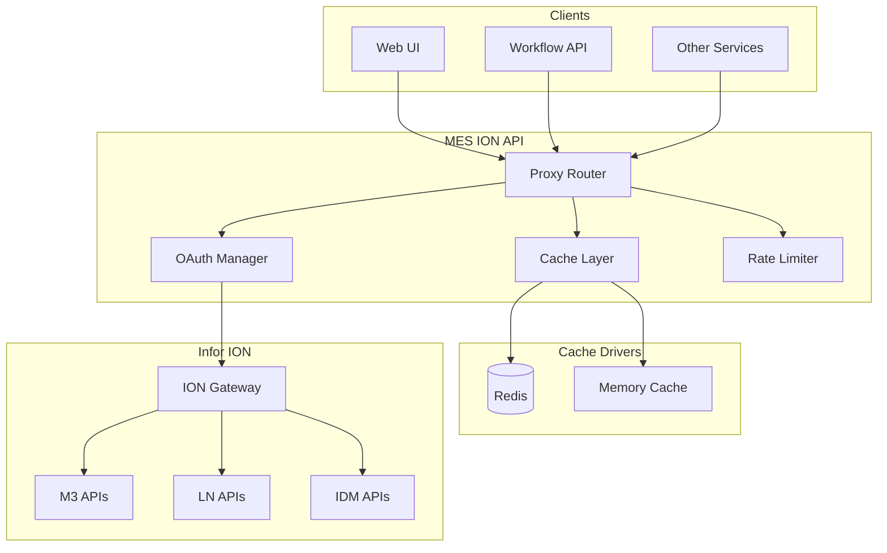

# MES ION API Documentation

## Overview
MES ION API is an API gateway service that provides centralized integration with Infor ION APIs. It handles OAuth 2.0 authentication, request proxying, caching, and rate limiting for all ION API communications.

## Key Features
- **OAuth 2.0 Management**: Automatic token acquisition and refresh
- **API Gateway**: Universal proxy for all ION API endpoints
- **Caching Layer**: Configurable caching with Redis or memory drivers
- **Rate Limiting**: Request throttling to prevent API overload
- **Health Monitoring**: Service health checks and readiness probes
- **Metrics Collection**: Prometheus-compatible metrics endpoint
- **Error Handling**: Comprehensive error recovery and retry logic

## Documentation Structure

### [Architecture](./architecture/)
- [System Overview](./architecture/system-overview.md) - High-level architecture
- [Authentication Flow](./architecture/authentication.md) - OAuth 2.0 implementation
- [Request Processing](./architecture/request-flow.md) - Gateway request handling
- [Error Handling](./architecture/error-handling.md) - Error recovery patterns

### [API](./api/)
- [Proxy Endpoint](./api/proxy.md) - Main gateway endpoint
- [Health Endpoints](./api/health.md) - Health and readiness checks
- [Metrics](./api/metrics.md) - Prometheus metrics endpoint
- [OpenAPI](./api/openapi.md) - API documentation

### [Integration](./integration/)
- [ION Configuration](./integration/ion-config.md) - ION API setup
- [M3 APIs](./integration/m3-apis.md) - M3 ERP integration
- [LN APIs](./integration/ln-apis.md) - LN system integration
- [IDM APIs](./integration/idm-apis.md) - Item master integration

### [Caching](./caching/)
- [Cache Strategy](./caching/strategy.md) - Caching patterns
- [Redis Driver](./caching/redis.md) - Redis implementation
- [Memory Driver](./caching/memory.md) - In-memory caching
- [Cache Keys](./caching/keys.md) - Key patterns and TTL

### [Deployment](./deployment/)
- [Docker](./deployment/docker.md) - Container configuration
- [Kubernetes](./deployment/kubernetes.md) - K8s deployment
- [Configuration](./deployment/configuration.md) - Environment variables
- [Security](./deployment/security.md) - Security best practices

### [Testing](./testing/)
- [Unit Tests](./testing/unit.md) - Component testing
- [Integration Tests](./testing/integration.md) - API testing
- [Load Testing](./testing/load.md) - Performance testing
- [Mocking](./testing/mocking.md) - Test doubles and stubs

## Technology Stack
- **Node.js 20+** - Runtime environment
- **TypeScript 5.6** - Type safety
- **Express 5** - Web framework
- **Axios** - HTTP client
- **IORedis** - Redis client
- **Jest** - Testing framework
- **Swagger** - API documentation

## Architecture Overview



## Quick Start

### Development Setup
```bash
# Install dependencies
npm install

# Configure ION credentials
export ION_API_JSON='{"ti":"...","cn":"...","ci":"...","cs":"...","iu":"...","pu":"...","oa":"...","ot":"...","or":"...","ev":"..."}'

# Start development server
npm run dev
```

### Production Build
```bash
# Build TypeScript
npm run build

# Start production server
npm start
```

### Testing
```bash
# Run all tests
npm test

# Unit tests only
npm run test:unit

# Integration tests
npm run test:integration

# Coverage report
npm run test:coverage
```

## API Endpoints

### Main Proxy Endpoint
- **URL**: `/api/v1/proxy/*`
- **Methods**: GET, POST, PUT, PATCH, DELETE
- **Authentication**: Automatic OAuth token injection

### Health Endpoints
- **Health Check**: `GET /health`
- **Readiness Check**: `GET /ready`

### Documentation
- **Swagger UI**: `/api-docs`
- **OpenAPI Spec**: `/openapi.json`

### Metrics
- **Prometheus Metrics**: `GET /metrics`

## Configuration

### Required Environment Variables
```bash
# ION API Configuration (Option 1: Complete JSON)
ION_API_JSON='{"ti":"tenant","cn":"name","ci":"client_id","cs":"secret","iu":"https://auth.url","pu":"token_endpoint","oa":"api_endpoint"}'

# ION API Configuration (Option 2: Individual variables)
ION_TENANT_ID=your_tenant_id
ION_CLIENT_ID=your_client_id
ION_CLIENT_SECRET=your_client_secret
ION_USERNAME=service_account
ION_PASSWORD=service_password
ION_TOKEN_ENDPOINT=https://auth.url/token
ION_GATEWAY_URL=https://api.gateway.url
```

### Optional Configuration
```bash
# Cache Configuration
CACHE_DRIVER=redis|memory (default: memory)
CACHE_TTL_SECONDS=300 (default: 300)
REDIS_URL=redis://localhost:6379

# Rate Limiting
RATE_LIMIT_WINDOW_MS=900000 (default: 15 minutes)
RATE_LIMIT_MAX_REQUESTS=1000 (default: 1000)

# Server Configuration
PORT=3000
NODE_ENV=production
LOG_LEVEL=info
```

## Cache Configuration

### Default TTL by Endpoint
| Endpoint Pattern | TTL (seconds) | Description |
|-----------------|---------------|-------------|
| `/m3api-rest/*` | 300 | M3 API queries |
| `/IDM/api/items` | 600 | Item master data |
| `/LN/api/*` | 300 | LN API queries |
| OAuth tokens | token_expiry - 60 | Token caching |

## Performance Targets
- **Response Time**: < 100ms overhead (p95)
- **Token Refresh**: < 500ms
- **Cache Hit Ratio**: > 80%
- **Concurrent Requests**: 500+ RPS

## Security Features
- OAuth 2.0 password grant flow
- Automatic token refresh
- Request/response logging with redaction
- Rate limiting per client
- CORS configuration
- Helmet.js security headers

## Monitoring
- Health check endpoints
- Prometheus metrics
- Request/response logging
- Error tracking
- Cache hit/miss ratios
- Token refresh metrics