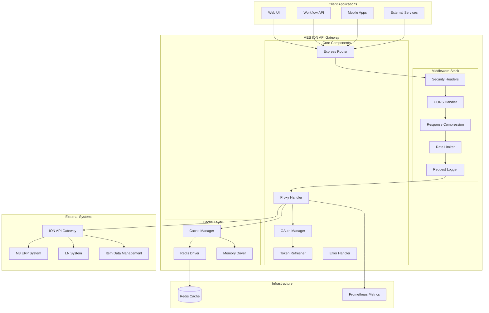
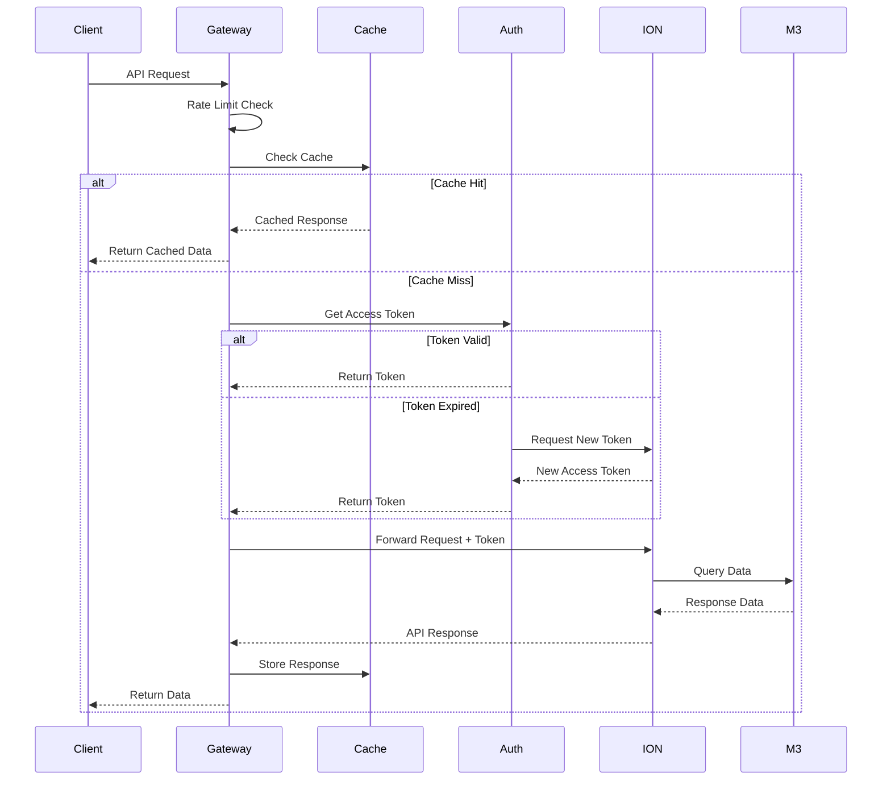
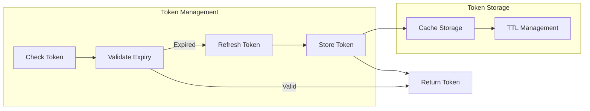
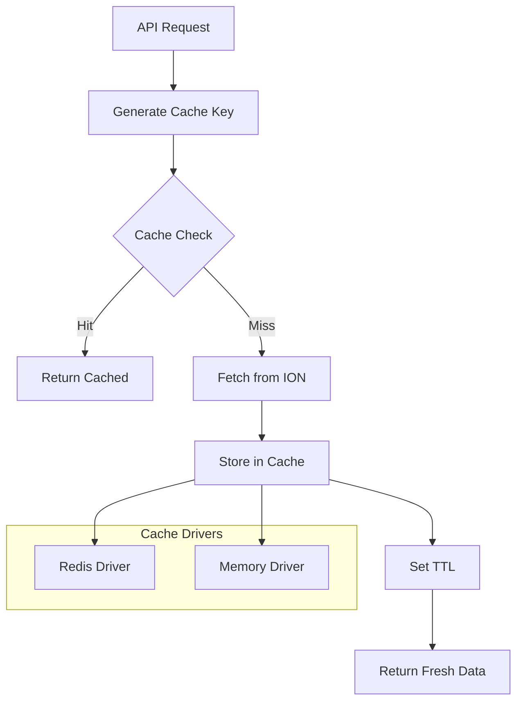
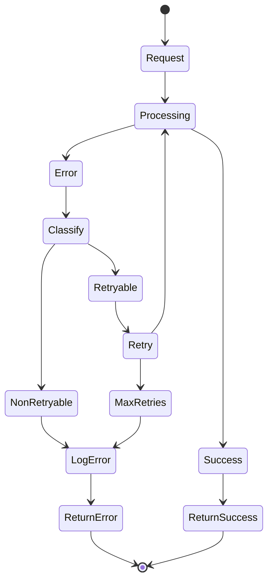
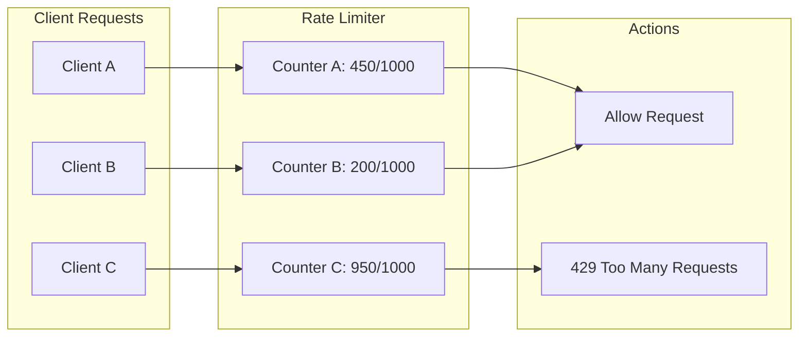

# System Architecture Overview

## High-Level Architecture



## Component Architecture

### Application Structure
```
src/
├── app.ts                 # Express application setup
├── server.ts             # Server initialization
├── routes/
│   ├── proxy.ts         # Main proxy endpoint
│   ├── health.ts        # Health check endpoints
│   └── metrics.ts       # Prometheus metrics
├── integrations/
│   └── ion/
│       ├── auth.ts      # OAuth authentication
│       ├── client.ts    # ION API client
│       ├── config.ts    # ION configuration
│       └── token-refresher.ts # Token management
├── cache/
│   ├── manager.ts       # Cache abstraction
│   └── drivers/
│       ├── redis.driver.ts    # Redis implementation
│       └── memory.driver.ts   # Memory implementation
├── middleware/
│   ├── rate-limiter.ts  # Request throttling
│   ├── error-handler.ts # Error handling
│   └── logger.ts        # Request logging
└── services/
    └── health-check.service.ts # Health monitoring
```

## Request Flow

### Standard Request Processing


## Authentication Architecture

### OAuth 2.0 Flow


### Token Refresh Strategy
```typescript
class TokenRefresher {
  // Proactive refresh - 5 minutes before expiry
  private readonly REFRESH_BUFFER = 5 * 60 * 1000;
  
  // Check interval - every 60 seconds
  private readonly CHECK_INTERVAL = 60 * 1000;
  
  // Reactive refresh on 401 responses
  async handleUnauthorized(): Promise<void> {
    await this.clearToken();
    await this.refreshNow();
  }
  
  // Background refresh process
  private async backgroundRefresh(): Promise<void> {
    const token = await this.getToken();
    const expiresIn = token.expiresAt - Date.now();
    
    if (expiresIn < this.REFRESH_BUFFER) {
      await this.refreshNow();
    }
  }
}
```

## Caching Architecture

### Cache Layers


### Cache Key Strategy
```typescript
// Cache key generation
function generateCacheKey(req: Request): string {
  const parts = [
    'ion',
    req.method,
    req.path,
    crypto.createHash('md5')
      .update(JSON.stringify(req.query))
      .digest('hex')
  ];
  return parts.join(':');
}

// TTL configuration by endpoint
const ttlConfig = {
  '/m3api-rest': 300,      // 5 minutes
  '/IDM/api/items': 600,   // 10 minutes
  '/LN/api': 300,          // 5 minutes
  default: 300             // 5 minutes
};
```

## Error Handling Architecture

### Error Classification
```typescript
enum ErrorCode {
  // Authentication errors
  INVALID_CREDENTIALS = 'AUTH_001',
  TOKEN_EXPIRED = 'AUTH_002',
  TOKEN_REFRESH_FAILED = 'AUTH_003',
  
  // API errors
  UPSTREAM_ERROR = 'API_001',
  TIMEOUT = 'API_002',
  INVALID_REQUEST = 'API_003',
  
  // System errors
  CACHE_ERROR = 'SYS_001',
  RATE_LIMIT_EXCEEDED = 'SYS_002',
  INTERNAL_ERROR = 'SYS_003'
}
```

### Error Recovery Flow


## Rate Limiting Architecture

### Rate Limit Strategy
```typescript
const rateLimitConfig = {
  // Window configuration
  windowMs: 15 * 60 * 1000,  // 15 minutes
  max: 1000,                  // 1000 requests per window
  
  // Client identification
  keyGenerator: (req: Request) => {
    return req.headers['x-client-id'] || 
           req.ip || 
           'anonymous';
  },
  
  // Skip health checks
  skip: (req: Request) => {
    return req.path === '/health' || 
           req.path === '/ready';
  }
};
```

### Rate Limit Distribution


## Monitoring Architecture

### Health Check System
```typescript
interface HealthCheckResult {
  status: 'healthy' | 'degraded' | 'unhealthy';
  timestamp: Date;
  checks: {
    cache: ComponentHealth;
    ionApi: ComponentHealth;
    tokenRefresh: ComponentHealth;
  };
  metrics: {
    responseTime: number;
    cacheHitRatio: number;
    activeConnections: number;
  };
}
```

### Metrics Collection
```typescript
// Prometheus metrics
const metrics = {
  httpRequestDuration: new Histogram({
    name: 'http_request_duration_seconds',
    help: 'Duration of HTTP requests in seconds',
    labelNames: ['method', 'route', 'status']
  }),
  
  cacheHits: new Counter({
    name: 'cache_hits_total',
    help: 'Total number of cache hits',
    labelNames: ['endpoint']
  }),
  
  tokenRefreshes: new Counter({
    name: 'token_refreshes_total',
    help: 'Total number of token refreshes',
    labelNames: ['success']
  }),
  
  activeConnections: new Gauge({
    name: 'active_connections',
    help: 'Number of active connections'
  })
};
```

## Security Architecture

### Security Layers
1. **Transport Security**: HTTPS enforcement
2. **Authentication**: OAuth 2.0 token validation
3. **Authorization**: Header-based client identification
4. **Rate Limiting**: Request throttling per client
5. **Input Validation**: Request sanitization
6. **Output Filtering**: Response data filtering

### Security Headers
```typescript
// Helmet.js configuration
const securityHeaders = {
  contentSecurityPolicy: {
    directives: {
      defaultSrc: ["'self'"],
      styleSrc: ["'self'", "'unsafe-inline'"],
      scriptSrc: ["'self'"],
      imgSrc: ["'self'", "data:", "https:"],
    }
  },
  hsts: {
    maxAge: 31536000,
    includeSubDomains: true,
    preload: true
  },
  noSniff: true,
  xssFilter: true,
  referrerPolicy: { policy: 'same-origin' }
};
```

## Deployment Architecture

### Container Architecture
```dockerfile
# Multi-stage build
FROM node:20-alpine AS development
# Development dependencies and debugging

FROM node:20-alpine AS builder
# Production build

FROM node:20-alpine AS production
# Minimal runtime with security
USER nodejs:1001
```

### Kubernetes Deployment
```yaml
apiVersion: apps/v1
kind: Deployment
spec:
  replicas: 2
  template:
    spec:
      containers:
      - name: mes-ion-api
        resources:
          requests:
            memory: "128Mi"
            cpu: "100m"
          limits:
            memory: "512Mi"
            cpu: "500m"
        livenessProbe:
          httpGet:
            path: /health
        readinessProbe:
          httpGet:
            path: /ready
```

## Scalability Considerations

### Horizontal Scaling
- Stateless design allows multiple instances
- Redis cache shared across instances
- Load balancing via Kubernetes service

### Performance Optimizations
- Connection pooling for HTTP clients
- Response compression with gzip
- Efficient cache key generation
- Minimal middleware overhead

### Resource Management
- Memory limits enforced
- CPU throttling configured
- Connection limits implemented
- Graceful shutdown handling