# MES ION API Architecture Diagrams

## System Context Diagram

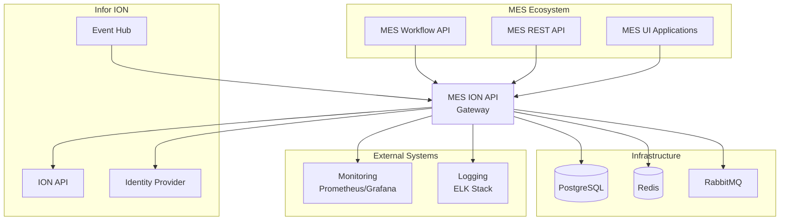

## Component Architecture

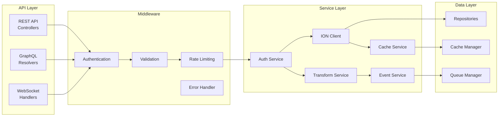

## Authentication Flow

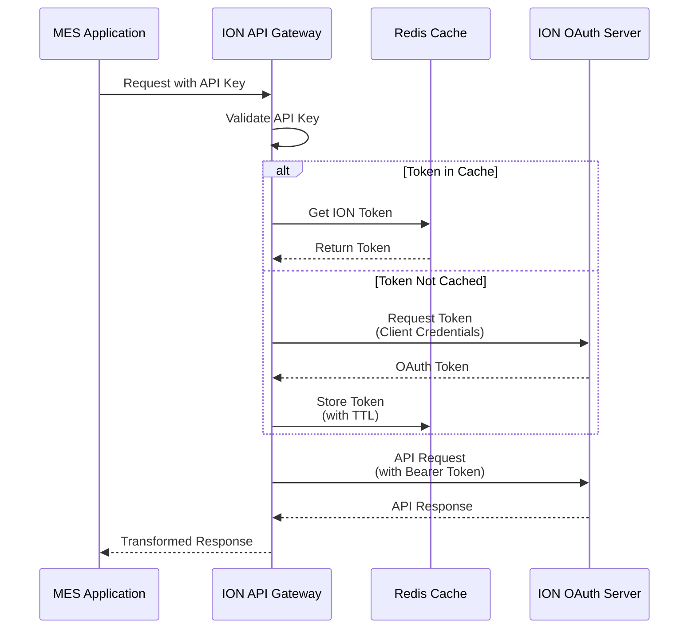

## Data Flow - Manufacturing Order

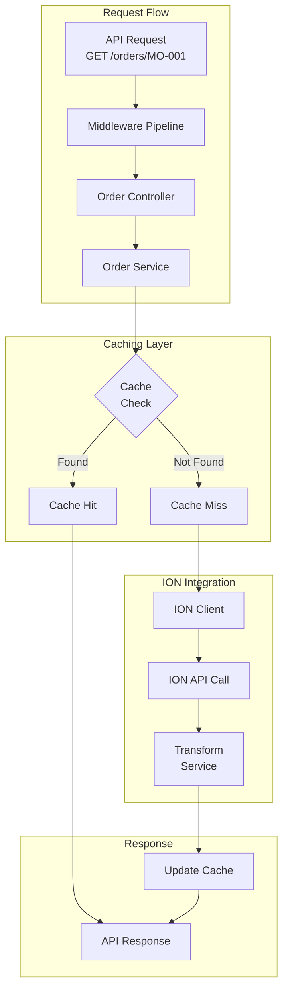

## Event Processing Architecture

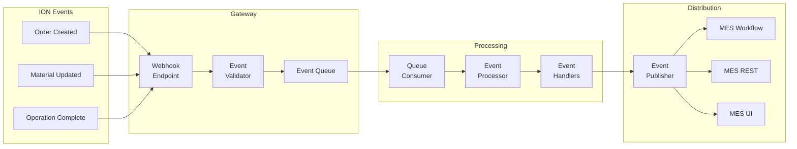

## Database Schema

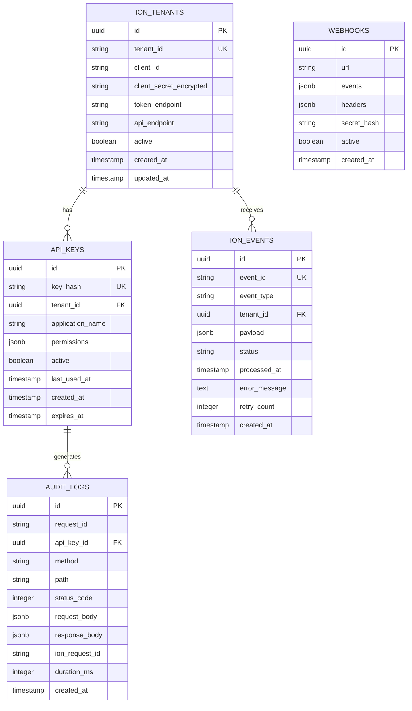

## Deployment Architecture

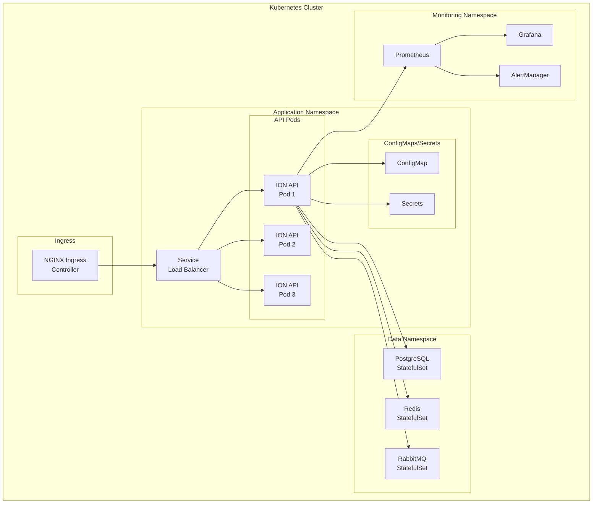

## Error Handling Flow

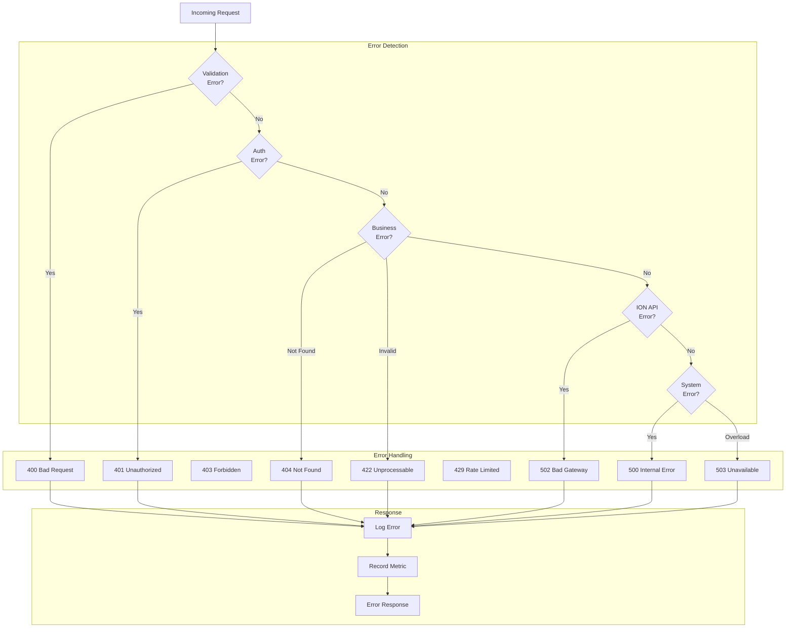

## Circuit Breaker Pattern

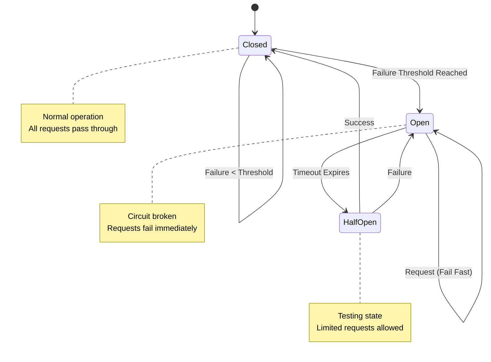

## Cache Strategy

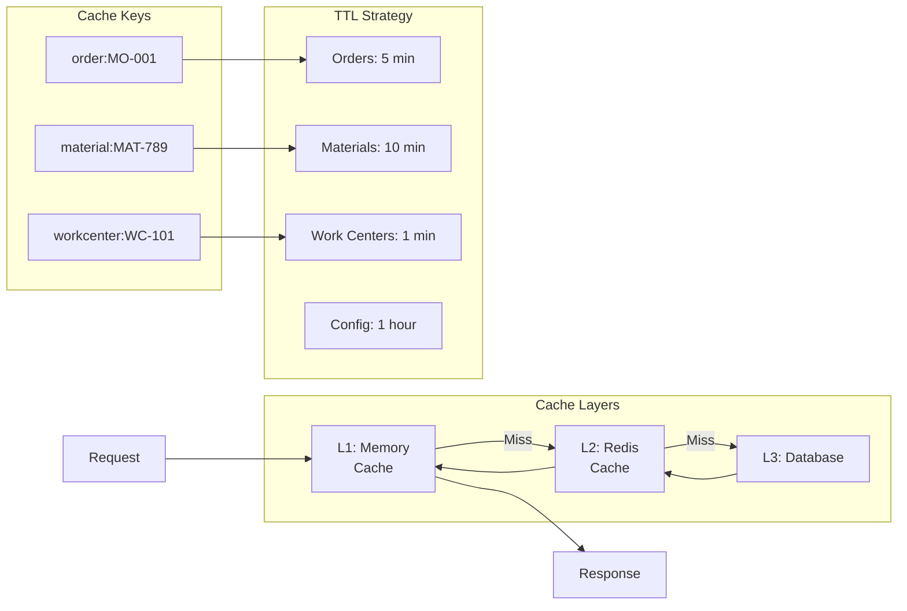

## Monitoring Dashboard Layout

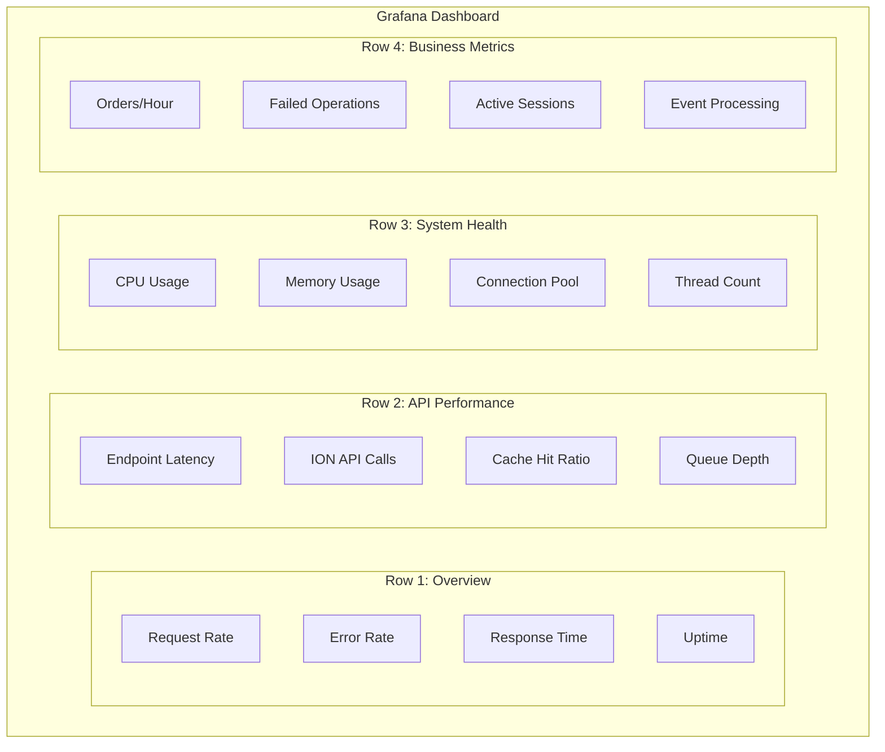

These diagrams provide a comprehensive view of the MES ION API architecture, showing system context, component interactions, data flows, and operational aspects. They can be rendered using Mermaid-compatible tools or documentation systems.